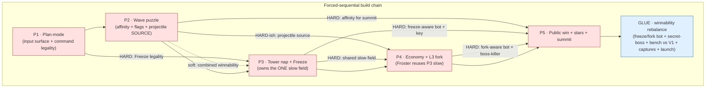

# Depth Pass — Dependency Graph & Batches

How the five specs sequence, *why*, and which shared files force it. The short
version: this pass is **forced-sequential** — there is no genuinely
parallel-safe pair, because the core four files (`Simulation.js`, `Renderer.js`,
`gameConfig.js`, `InputController.js`) plus the sim systems are co-edited by most
specs, and the hard dependency edges already chain P1→P3→P4 and P2→P4 with P5 as
the capstone.

## The real dependency edges

Derived from each spec's `dependsOn` + `filesTouched`. Classified **HARD**
(reordering breaks correctness) vs **SOFT** (improves the story / shared
plumbing, but the dependent ships standalone).

| Edge | Strength | Reason |
|------|----------|--------|
| P3 → P1 | **HARD** | Freeze is a HUD button; `castFreeze()` is status-gated to `playing` and must be explicitly illegal in P1's `planning`/`paused`. P1 owns the input surface + command-legality the Freeze button rides on (P3 test 8 pins this). |
| P4 → P3 | **HARD** | Froster reuses P3's **single** shared slow field (`effectiveSpeed(state,e)` + `applySlow` + enemy `slowUntil`/`slowFactor`). Two slow mechanisms are explicitly forbidden; P4's Froster test asserts the *same* fields P3's Freeze sets. |
| P4 → P2 | **HARD-ish** | Both thread a damage *source* onto the projectile at `fire()`→`impact()` (`damageEnemy` carries none today). P4's Sniper crit + Froster slow ride the same projectile-source field P2 adds for affinity. If P2 hasn't landed, P4 must introduce the minimal carry itself — so build P2 first. |
| P3 → P2 | SOFT (HARD for combined winnability) | P2 supplies the AoE-affinity half of the split-boss pin→burst win path P3 keys off; P3's telegraphs reuse P2's Recon-banner vocabulary. P3's own nap/freeze behavior is independently testable. |
| P5(B) → P2,P3,P4 | **HARD** (Half B only) | The summit / split-boss winnability tuning needs affinity (P2), the Freeze skill-key + freeze-aware bot (P3), and the powered Bomber/Froster fork + fork-aware bot (P4) to exist before the margin can be tuned between "wall" and "buy-the-win". |
| P5(A) → ∅ | none | Half A (public-win gate flip + stars + L3 sprite-fit clamp) depends on nothing in P2/P3/P4. But it still co-edits the hottest files, so it is **not** parallel-safe (below). |
| P2 → {P5,P4,P1} | SOFT | P2 reads better after P5's sprite-fit/anti-dominant guard, P4's cheap re-fork, and P1's calm window — but P2 is fully testable headless without them. Do **not** let these soft edges reorder the chain. |

Net hard chain: **P1 → P2 → P3 → P4 → P5**. Every soft edge points the same
direction or is dominated by a hard one, so the linear order is unambiguous.

## Shared hot files (the merge-conflict surface)

Touched-by counts across the five specs. Anything ≥2 forces sequencing if specs
were run concurrently; the ALL-5 files make any parallelism a guaranteed
collision in the core.

| File | P1 | P2 | P3 | P4 | P5 | Count | Note |
|------|----|----|----|----|----|-------|------|
| `v2/config/gameConfig.js` | ✓ | ✓ | ✓ | ✓ | ✓ | **5** | Every spec adds a config block. Additive but same file — concurrent edits conflict. |
| `v2/render/Renderer.js` | ✓ | ✓ | ✓ | ✓ | ✓ | **5** | Plan frame / tray (P1), flag glyphs + Recon banner (P2), nap/freeze visuals (P3), fork card + range preview (P4), win/stars/summit overlay (P5). Same render gate + HUD dock. |
| `v2/sim/Simulation.js` | ✓ |  | ✓ | ✓ | ✓ | 4 | Command surface: `togglePlanning`/`selectTray`/`readyNow` (P1), `castFreeze` (P3), `forkSelected` (P4), `continueToSummit` + `_checkWinLose` (P5). |
| `v2/sim/events.js` |  | ✓ | ✓ | ✓ | ✓ | 4 | EV registry — additive but same object. |
| `v2/sim/systems/enemySystem.js` |  | ✓ | ✓ | ✓ |  | 3 | `damageEnemy` widening + affinity (P2), `effectiveSpeed(state,e)` + slow field (P3), slow consumption (P4). P3 owns the slow seam; P2/P4 reuse it. |
| `v2/sim/state.js` | ✓ |  | ✓ |  | ✓ | 3 | State factory fields (trayType/autoPlanned, freeze, publicWinBanked/summitMode/stars). |
| `v2/render/SpriteCache.js` |  | ✓ | ✓ | ✓ | ✓ | 4 | Flag glyphs (P2), nap/frost (P3), fork overlays (P4), footprint clamp (P5). |
| `v2/input/InputController.js` | ✓ |  |  | ✓ | ✓ | 3 | P1 reworks `_dispatch` + world-tap gate; P4 adds `fork` (and fixes data-threading P1 introduced); P5 adds `continueSummit`. |
| `tools/balance/harness.mjs` |  | ✓ | ✓ | ✓ | ✓ | 4 | Bot command-API helpers (flags, freeze, fork, summit-drive). |
| `tools/balance/policies.mjs` | ✓ | ✓ | ✓ | ✓ |  | 4 | Affinity-aware → freeze-aware → fork-aware optimal, layered. |
| `v2/sim/systems/towerSystem.js` |  |  | ✓ | ✓ |  | 2 | Nap fields + skip/wake (P3); fork stats + `effectiveStats` (P4). |
| `v2/sim/systems/projectileSystem.js` |  | ✓ |  | ✓ |  | 2 | Source threading (P2); crit/aoe/slow on projectile (P4). |
| `v2/sim/systems/waveSystem.js` |  | ✓ |  |  | ✓ | 2 | Flags/entry + Recon (P2); win-gate flip + BOSS_DEFEATED + summit (P5). |
| `tools/balance/measure-secret-boss.mjs` |  |  | ✓ | ✓ | ✓ | 3 | Re-measured with freeze-aware (P3), fork-aware (P4), via summit path (P5). |
| `v2/app/GameApp.js` |  | ✓ |  | ✓ | ✓ | 3 | Locked-fixture lever application (flags, forks, summit/audio bridge). |

**Conclusion:** `gameConfig.js` + `Renderer.js` alone (touched by all five) make
concurrent work a guaranteed core collision. Layered evolution of the same
methods — `damageEnemy`, `effectiveSpeed`, `Simulation` command block,
`InputController._dispatch`, the `optimal` policy — means each later spec wants
the previous spec's version of the file as its baseline. Sequential is not a
scheduling preference here; it is what the file topology + hard edges dictate.

## Batches

Each batch is a single spec. Mode is `sequential` because no batch can overlap
the next without colliding in the core files above. The "parallel" mode is never
used — stated explicitly rather than faked.

| Batch | Spec | Mode | Why it can't overlap its neighbours |
|-------|------|------|-------------------------------------|
| 1 | **P1** | sequential | Foundation. Owns the input surface + command-legality (`InputController._dispatch`, world-tap gate) and the `planning` sub-state that P3's Freeze legality and P4's fork-while-planning both ride on. Touches `Simulation.js`, `state.js`, `gameConfig.js`, `Renderer.js`, `policies.mjs` — the baseline every later spec edits. |
| 2 | **P2** | sequential | Adds the projectile **source** field (`p.sourceType`) at `fire()`→`impact()` that P4 hard-reuses, plus the `damageEnemy(state,e,amount,opts)` widening P4 builds on. Co-edits `enemySystem.js`, `events.js`, `Renderer.js`, `SpriteCache.js`, `gameConfig.js`, `policies.mjs`. Must land before P3 (winnability) and P4 (source plumbing). |
| 3 | **P3** | sequential | HARD-needs P1 (Freeze legality). Owns the **single** slow field in `effectiveSpeed(state,e)` + `applySlow` that P4's Froster reuses — must exist before P4. Co-edits `enemySystem.js`, `towerSystem.js`, `Simulation.js`, `events.js`, `state.js` with P1/P2/P4. |
| 4 | **P4** | sequential | HARD-needs P3 (slow field) + P2 (projectile source). Layers `forkSelected`/`effectiveStats` onto the same `towerSystem`/`projectileSystem`/`Simulation` P3 and P2 just edited; fixes the `InputController` data-threading P1 introduced. |
| 5 | **P5** | sequential | Half A is dependency-free but co-edits the four hottest files (`Simulation._checkWinLose`, `state.js`, `Renderer._overlay`, `gameConfig.js`, `waveSystem.js`) so it can't run parallel. Half B HARD-needs P2+P3+P4 to validate split-boss winnability — naturally last. Flips the win gate; the capstone before GLUE. |

### Why P5 Half A is still last (not pulled forward in parallel)

P5 Half A (public-win + stars + sprite-fit) has **zero** dependency edges and is
the only true "standalone S" slice in the pass. It is tempting to run it
alongside P1. We do not, because:

- It edits `Simulation._checkWinLose` (P1, P3, P4 also edit `Simulation.js`),
  `state.js` (P1, P3), `Renderer._overlay` (all five touch `Renderer.js`),
  `waveSystem.js` (P2), `events.js` (P2, P3, P4), `gameConfig.js` (all five),
  `InputController.js` (P1, P4) — i.e. it collides with P1 directly on four of
  the hottest files. The dependency graph says "free", the file graph says "no".
- Its tests flip terminal expectations in `balance-ladder` / `secret-wave` /
  `playthrough` from `lost@16` to `won@15`. Those same suites are the parity
  gate every other spec must keep green. Flipping them mid-stream would make
  P2/P3/P4's "no regression" assertions ambiguous. Landing P5 last keeps the
  terminal-expectation flip a single, clean, final move.

So Half A could be *scheduled* early in a fork-free world, but in this repo it is
cheaper and safer as the final batch alongside Half B.

## Mermaid graph

Solid edges that are also part of `P1→P2→P3→P4→P5` are both the linear order
*and* a hard/soft dependency; dotted is the lone soft edge (P2→P3) that happens
to agree with the chain.

## GLUE — final winnability rebalance (after P5)

Not a spec; the required integration closeout once all five have landed
individually. Each spec already re-runs its own slice of this against the
then-current game, but the pass is only "done" when the **fully-composed** game
is validated end-to-end with every lever live at once.

1. **Freeze/fork-aware bot, end-to-end.** Confirm the `optimal` policy
   (`policies.mjs`) now drives, through the public command API only:
   tray placement (P1), affinity-correct tool choice (P2),
   `freeze()` offensive-bunch / defensive-leak triggers (P3),
   `fork()` + `reFork` keyed to the telegraphed threat (P4),
   and `continueToSummit()` past the public win (P5). Re-assert the 4-tier
   ladder's monotone separation (unfocused ≤W4, spread <W15, saveUpgrade ≥W10
   & loses, optimal wins@15 then loses@16 via summit) on the composed game.

2. **`measure-secret-boss.mjs` via the summit path.** With the full
   freeze+fork+affinity composition driving and the run now *winning* at 15, the
   harness must opt into the summit on the win to still reach wave 16. Record the
   re-measured split-boss damage margin on the **real composed game** — replacing
   the stale ~7.2x figure — and confirm it lands in the intended band: beatable
   only with the executed Freeze+AoE-affinity+Bomber/Froster combo, never by raw
   buy-the-win, and never accidentally trivial. If it can't be tuned into that
   band, honor P5's documented fallback: ship the public win, leave the summit an
   aspirational endless hook (no config change to the public game).

3. **Full bench vs V1.** `npm run bench` on the locked fixture now carrying
   **all** power-bearing levers at once (P2 flags `[armored,evasive,regen]` incl.
   the single animated evasive overlay; P3 `disablers:2` + scripted freeze
   cadence; P4 forked L3 towers incl. an active Froster slow). V2 p95 must be
   < V1 p95 and within the 15% self-regression margin. Confirm the one animated
   flag is the only per-frame non-blit cost and `MAX_STEPS_PER_FRAME` is
   untouched.

4. **Full `npm test`.** Every suite green with all five landed — no suite
   weakened; the terminal-expectation flip (won@15) consistent across
   balance-ladder #4, secret-wave, and playthrough DoD#2.

5. **Full capture regen.** Regenerate before/after captures for the composed
   game via `tools/harness/captureAll.mjs` + `captureAnim.mjs` +
   `visualCheck.mjs` under `v2/captures/` (plan frame, tray, ready valve;
   affinity tells + flag glyphs + Recon banner + reverse entry; nap + beam
   telegraph + freeze field; fork card + range preview + 4 fork sprites + Froster
   slow; win+stars card + L3 sprite-fit + summit dare + wave-16 board).

6. **Local launch sanity.** Serve the static build (`tools/harness` static
   server / plain `python -m http.server` over `v2/`) and play a full run in
   Chrome: plan → build via tray → "I'm ready!" → read a Recon banner → use
   Freeze on a clustered wave → fork a tower at L3 → clear wave 15 → see the
   win+stars card → optionally take the summit dare. Confirm no console errors
   and 60fps holds.
