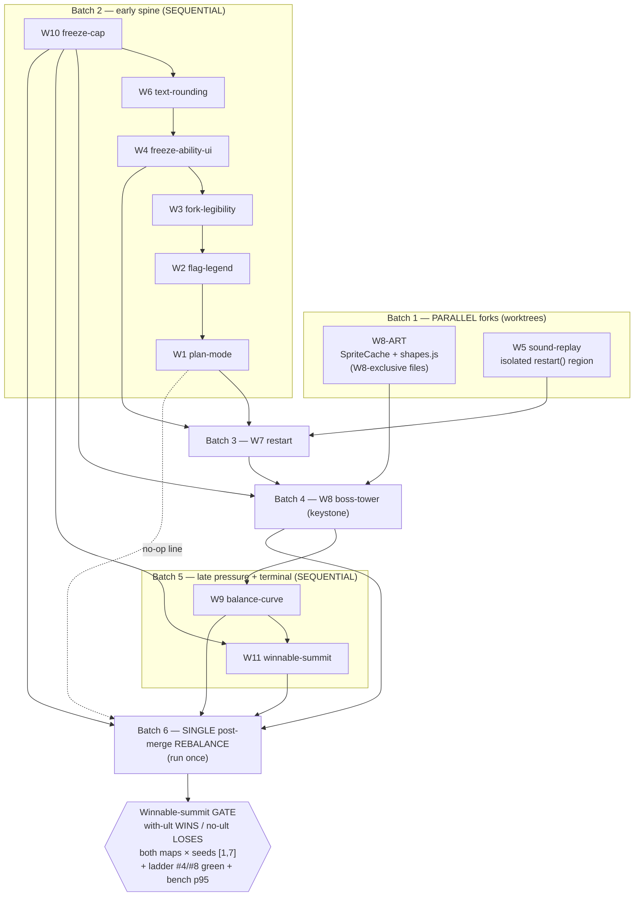

# CuteDefense V2.1 — Execution Plan

Branch: `v2-depth-pass` (builds ON the landed depth pass — do NOT touch V1 / main).
Source: the 11 research briefs in `v2/docs/v2.1/research/` (W1–W11).
Goal of the pass: the secret wave-16 SPLIT boss flips from an *unbeatable wall* into a
*skill-gated win*, with the new boss-tower manual ultimate (W8) as the offensive key (W11).

---

## 1. The honest parallelism story

The five core files are touched by almost every item, so most of the pass is **forced
sequential**. Faking fan-out here would just produce merge-collisions on the same hunks.

### Shared hot files (touch count across W1–W11)

| File | Items that edit it | Verdict |
|------|--------------------|---------|
| `v2/config/gameConfig.js` | W1, W2, W3, W4, W6, W8, W9, W10, W11 (9) | **spine** — different sub-blocks, but the single most contended file; serialize |
| `v2/render/Renderer.js` | W1, W2, W3, W4, W6, W7, W8 (7) | **spine** — `_hud`/`_towerCard`/`_forkRow`/`_reconBanner`/bottom-bar all collide |
| `v2/sim/Simulation.js` | W1, W5, W8, W11 (4) | **spine** — except W5's isolated `restart()/toMenu()` region |
| `tools/balance/policies.mjs` | W1, W8, W11 (3) | **spine** — monotonic W1 → W8 → W11 |
| `v2/sim/systems/waveSystem.js` | W2, W9, W11 (3) | **spine** — `reconFor` / `computeScaling` / `isSummitComplete` |
| `v2/sim/systems/towerSystem.js` | W3, W6, W8 (3) | **spine** — `_towerCard` stat helpers + upgrade cap |
| `v2/input/InputController.js` | W1, W7, W8 (3) | **spine** — `_dispatch` cases (additive but coordinate) |
| `v2/sim/systems/enemySystem.js` | W8, W10 (2) | low — W10 floor then W8 `damageEnemy({ignoreShield})` |
| `v2/sim/events.js` | W8, W11 (2) | low — additive event keys |
| `v2/render/palette.js` | W4, W8 (2) | low — additive color blocks |
| `tools/balance/measure-secret-boss.mjs` | W8, W11 (2) | low — W8 scenario C stub, W11 separation assert |

### True forkable slices (genuinely non-overlapping files → safe worktree forks)

Only two slices are real parallel forks. Everything else shares `gameConfig.js` and/or
`Renderer.js` and must merge through the sequential spine.

1. **W8-ART** — the procedural boss-tower sprite. Touches only **`v2/render/SpriteCache.js`**
   (footprint-aware 2× bake) and **`v2/render/shapes.js`** (new `fortress`/`crown` path), both
   W8-exclusive, plus an *additive* `PALETTE.towers.boss` color block folded in at W8-merge. No
   sim logic, no config logic, no balance numbers. Can be generated in a worktree in parallel
   with the entire early spine and merged into W8.
2. **W5-bug-sound-replay** — the self-contained audio-bus restart fix. New
   **`tools/tests/audio-replay.test.mjs`** is conflict-free; the only product edit is the
   **isolated `Simulation.restart()/toMenu()` region** (which no other item touches). Trivial
   merge. MUST land before W7 (W7's new in-game RESTART button flows through the same
   `restart()` and inherits the silent-replay bug until W5 lands).

### Where parallel is NOT safe (do not fake it)

- W2 / W3 / W6 look independent but **all three edit `Renderer.js` and `gameConfig.js`** —
  parallel worktrees would collide in `_towerCard` / the config blocks. Sequential.
- W4 / W7 / W8 all restructure the **HUD bottom control row** (freeze button → restart 2→3
  button restructure → ultimate button). Hard collision. Strict order W4 → W7 → W8.
- W9 / W11 both edit `waveSystem.js` + `gameConfig.js` + (W11) `Simulation.js`/`policies.mjs`.
  Sequential, and both gated behind W8.
- W10 shares `gameConfig.js` with W8/W11 and `enemySystem.js` with W8 — low contention but kept
  in the spine so the freeze floor exists before the ultimate composes against it.

---

## 2. Ordered batches

### Batch 1 — parallel forks (start immediately, in worktrees)

**Mode: PARALLEL.** Two genuinely file-independent slices. They run alongside Batch 2 and merge
into their consumers (W8-ART → W8; W5 → before W7).

- **W8-ART** — procedural boss-tower sprite (`SpriteCache.js` 2× footprint bake + `shapes.js`
  fortress path + additive `PALETTE.towers.boss`). Why parallel-safe: W8-exclusive render files,
  no overlap with the sim/config spine.
- **W5-bug-sound-replay** — isolated `Simulation.restart()/toMenu()` audio-bus fix + new test.
  Why parallel-safe: isolated region + brand-new test file; no other early-spine item touches
  those bodies. Gate: must merge **before W7**.

### Batch 2 — early spine: legibility + freeze foundation

**Mode: SEQUENTIAL** (every item shares `gameConfig.js`, most share `Renderer.js`/`policies.mjs`).
Ordered so later card/HUD/ability work inherits the earlier scaffolding.

1. **W10-freeze-cap** — `enemySystem.effectiveSpeed` floor + `freeze.minSpeedFraction` key.
   Land first so the W8 ultimate (if it slows) and W11 compose against a known slow floor.
   Default 0.15 < slowMult 0.18 → single-freeze unchanged → ladder + secret-boss measure unmoved
   at merge.
2. **W6-bug-text-rounding** — `format.js` `fmtStat` + overflow guard. Land before any card work
   so W3/W8 stat lines route through `fmtStat`.
3. **W4-freeze-ability-ui** — new `abilityHud.js` slot/state pattern + ability config block +
   ability color ramp. Establishes the reusable idiom the W8 ultimate slots a *second* ability
   into. Must precede W7 and W8 (bottom-bar).
4. **W3-fork-legibility** — `_forkRow`/`_towerCard` + fork config strings; inherits `fmtStat`.
   Before W8 (which retouches `_towerCard` for the ultimate row + the upgrade cap in
   `towerSystem`).
5. **W2-flag-legend** — `waveSystem.reconFor` + `_reconBanner`/`_announcement` + `enemyFlags`
   config. Pure legibility; sequenced only because it shares `Renderer.js`/`gameConfig.js`.
6. **W1-planmode** — remove the skip-countdown valve; keep plan-mode usable mid-wave. Touches
   `policies.mjs` + `balance-ladder.test` — land before W8/W11 to keep the policies edits
   monotonic. Balance-neutral (valve was `readyBonusCoins=0`); enters the rebalance as a no-op.

### Batch 3 — in-game restart

**Mode: SEQUENTIAL.** Depends on W5 (Batch 1) being merged.

7. **W7-restart** — HUD bottom-control-row restructure (2→3 buttons) + `InputController._dispatch`
   case + optional `GameApp.toMenu()`. After W5 (audio-intact `restart()`), after W4 (ability
   button geometry), before W8 (so W8 slots the ultimate button into the final bottom-bar layout).

### Batch 4 — the keystone: boss tower + ultimate mechanism

**Mode: SEQUENTIAL** (largest, most file-sharing item; merges the W8-ART fork).

8. **W8-boss-tower** — 2×2 multi-tile placement, full-map range, slow plink, single upgrade
   unlocking `Simulation.castUltimate()` (shield-piercing full-map nuke), `EV.ULTIMATE_CAST`,
   `_ultimateButton`, dynamic N-column tray, harness `placeBoss`/`castUltimate`/`ultimateReady`,
   `summitConqueror` policy (ladder bots 1–4 stay boss-unaware), `measure-secret-boss` scenario C.
   Ships the **mechanism**; the rebalance ships the **values**. Add a boss tower to the bench
   fixture so the V2 p95 < V1 p95 gate stays honest.

### Batch 5 — late-game pressure + winnable terminal

**Mode: SEQUENTIAL** (share `waveSystem.js`/`gameConfig.js`/`Simulation.js`/`policies.mjs`/
`events.js`; both gated behind W8).

9. **W9-balance-curve** — `computeScaling` `lateSurge {fromWave,hp,count,speed}` + RED
   `balance-curve.test`. Inverts the curve so the late tail rises (optimal now bleeds lives in
   W11–15). The RED tests can only be greened once W8's offensive ceiling exists → tuned in the
   single rebalance. Raises wave-16 on-field HP (re-measure secret boss).
10. **W11-winnable-summit** — `SUMMIT_WON` terminal (`_checkWinLose` branch, NOT `GAME_WON`),
    `waveSystem.isSummitComplete`, `state.summitWon`, `policies.maybeUltimate` behind an
    `ultimate=false` flag, and the secret-wave **re-flip**. After W8 (mechanism + helpers) and
    W10 (floor) and W9 (curve sets final wave-16 HP).

### Batch 6 — the SINGLE post-merge rebalance

**Mode: SEQUENTIAL, run ONCE** (not per-fix). See §3.

---

## 3. The single post-merge rebalance (run once)

W8 (mechanism), W9 (raised late curve / RED tests), W10 (freeze floor lever), and W11 (the
winnable-summit gate) **all feed one rebalance**. W1's valve removal enters as a no-op line.
Tune the levers jointly, then assert the whole gate goes green simultaneously.

**Levers (all named gameConfig keys — no magic numbers):**
- `towers.boss.ultimate.{damage, cooldownMs, initialReadyFraction}`
- `towers.boss.{cost, fireRateMs}` (per level)
- `enemies.boss_split.behavior.childHp` (shard HP; start 22000 — above Ribbon's ~7k no-ultimate
  shard capacity so the no-ultimate fail-safe still leaks)
- `enemies.boss_splitling.behavior` shield duration (or rely on `ignoreShield`)
- `enemies.boss_split.hp` stays **24000** (the ~176k on-field parent — the wall for build-alone)
- `waves.scaling.lateSurge {fromWave, hp, count, speed}` (count held ~1.05, reward untouched —
  do NOT re-flood the economy)
- `freeze.minSpeedFraction` (stacked-slow floor)

**Gating sim assertions — ALL green at once:**
1. `balance-curve.test` — the 3 new late-tail assertions GREEN (curve now rises).
2. `balance-ladder` #4 — `optimal()` (no ultimate) still **WINS all 15** public waves.
3. `balance-ladder` #8 — boss life-drain stays **>= 4 lives**.
4. **Winnable-summit separation** (see §4) — `optimal({ultimate:true})` WINS the summit with
   `lives>0`; `optimal()` (no ultimate) LOSES — on **both maps × seeds [1,7]**.
5. `summit.test` — `GAME_WON` fires **exactly once** (the new terminal emits `SUMMIT_WON`).
6. `measure-secret-boss.mjs` — A/A2/B no-ultimate margins **>=5×** (freeze+fork) / **>=3×**
   (fork-only) unchanged; **Scenario C** (with ultimate) wins and every map/seed separates.
7. `npm test` — full suite green (106+ tests).
8. `npm run bench` — **V2 p95 < V1 p95** with the boss tower added to the bench fixture.

---

## 4. The winnable-summit gate (the pass's big reversal)

The separation that proves the reversal, owned by W11, gated by the rebalance:

- **WITH the ultimate** — `POLICIES.optimal({ ultimate: true })` drives the summit on **both
  maps × seeds [1,7]** and ends `status === 'won'`, with `SUMMIT_WON` fired,
  `state.summitWon === true`, `bossReachedGoal === false`, **`state.lives > 0`** (lives to
  spare), and `publicWinBanked` still `true`.
- **WITHOUT the ultimate** — `POLICIES.optimal()` (boss-unaware) ends `status === 'lost'`,
  `bossReachedGoal === true`, `publicWinBanked === true`. The wall still stands for the
  standard kit.
- **Re-flip of `secret-wave.test.mjs`** — the old single "STRONG player CANNOT kill the secret
  boss" test is split in two: **KEEP** (no-ultimate still loses) + **NEW** (with-ultimate wins
  with lives to spare). `measure-secret-boss.mjs` Scenario C fails the script unless every
  map/seed separates (WITH = win, WITHOUT = loss).

Why it works where last pass failed: the W8 ultimate is a **flat, full-map, shield-piercing
nuke** — **map-agnostic** damage that does not flow through tower coverage, so the win band is
non-empty on both Ribbon and Comb (the coverage-driven freeze-pin's band was empty).

---

## 5. Dependency graph

---

## 6. Quick reference — file-touch matrix

| Item | gameConfig | Renderer | Simulation | waveSystem | towerSystem | enemySystem | InputCtrl | policies | events | palette | other |
|------|:--:|:--:|:--:|:--:|:--:|:--:|:--:|:--:|:--:|:--:|---|
| W1  | x | x | x |   |   |   | x | x |   |   | balance-ladder.test |
| W2  | x | x |   | x |   |   |   |   |   |   | captureP2 |
| W3  | x | x |   |   | x |   |   |   |   |   | captureP4 |
| W4  | x | x |   |   |   |   |   |   |   | x | **abilityHud.js (new)** |
| W5  |   |   | x* |   |   |   |   |   |   |   | **audio-replay.test (new)** |
| W6  | x | x |   |   | x |   |   |   |   |   | format.js |
| W7  |   | x |   |   |   |   | x |   |   |   | GameApp.js |
| W8  | x | x | x |   | x | x | x | x | x | x | SpriteCache, shapes, harness, measure |
| W9  | x |   |   | x |   |   |   |   |   |   | balance-curve.test (new) |
| W10 | x |   |   |   |   | x |   |   |   |   | freeze.test |
| W11 | x |   | x | x |   |   |   | x | x |   | state.js, measure, SECRET-WAVE.md |

`*` = W5 touches only the isolated `restart()/toMenu()` region of `Simulation.js`.
