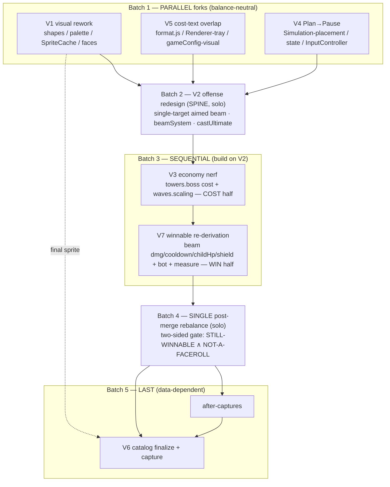

# CuteDefense V2.2 — Boss-Tower Rework: EXECUTION PLAN

**Branch:** `v2-depth-pass` · **Derived from:** the 7 research briefs in
`v2/docs/v2.2/research/` (V1 visual, V2 offense, V3 economy, V4 pause, V5 bugs,
V6 catalog, V7 winnable). **Do NOT touch V1 or main.**

The headline change is **V2: the L2 boss ultimate goes FULL-MAP-AoE-nuke →
SINGLE-TARGET AIMED BEAM.** That deletes the current summit win (the old nuke hit
parent + 3 shards at once), so the winnable path must be **re-derived** (V7) and
the whole thing **rebalanced once, post-merge**, proving a *two-sided* gate.

---

## 1. The honest coupling picture

Most boss-tower work converges on the same four hot files
(`Simulation.js`, `gameConfig.js`, `Renderer.js`, `InputController.js`) plus the
balance tools. That is a **forced-sequential spine**. Only a few slices are
genuinely disjoint enough to fork:

- **V1 (visual rework)** — pure render: `palette.js` / `shapes.js` /
  `SpriteCache.js` / `faces.js`. Touches **no** `gameConfig.js`, **no** `v2/sim/*`,
  **no** `tools/balance/*`. Truly parallel; zero balance impact (shape id stays
  `fortress`).
- **V5 (boss-cost text overlap)** — new `format.js`, `Renderer.js` *tray /
  buy-button* region, `gameConfig.js` *visual* block, new test + harness. Shares
  `Renderer.js` + `gameConfig.js` with the spine **only in disjoint regions**
  (trivial merge). Zero balance impact.
- **V4 (Plan→Pause)** — `Simulation.js` *placement/status* region, `state.js`,
  `gameConfig.js` *plan* block, `InputController.js`, `Renderer.js` *control-row*,
  `harness.mjs`, 7 test files. **Balance-neutral** (bots never used plan-mode).
  Shares the combat-core files with the spine but in disjoint line ranges.
- **V6 (catalog)** — file-disjoint from all gameplay code, but its *content*
  (final numbers + new portrait) can only be finalized after the rebalance ⇒
  **runs LAST**.

Everything else — **V2 → V3 → V7 → rebalance** — is single-writer on
`towers.boss` / `Simulation.castUltimate` / the balance tools, so it serializes.

---

## 2. Batches

### Batch 1 — PARALLEL forks (balance-neutral, land before the spine)
**Items:** V1 (visual rework) · V5 (cost-text overlap) · V4 (Plan→Pause)
**Mode:** parallel (3 forks)

**Why:** all three are balance-neutral and mutually file-disjoint *or*
disjoint-region trivial merges. They each touch files the combat spine also edits
(`Renderer.js`, `gameConfig.js`, `Simulation.js`, `InputController.js`,
`harness.mjs`), so landing them **first** lets the spine (V2) hand-merge **once
against a settled base** instead of three-way churning the combat core. After this
batch the tree has the new sprite, the fixed HUD, and the renamed `paused` state —
all before any sim mechanic changes.

Pairwise safety inside the batch:
- V1 ⟂ V5: file-disjoint (V1 = shapes/palette/SpriteCache/faces; V5 =
  format/Renderer-tray/gameConfig-visual).
- V1 ⟂ V4: file-disjoint (V4 never touches shapes/SpriteCache).
- V4 ↔ V5: share `Renderer.js` (control-row vs `_tray`/`_towerBuyButton`) and
  `gameConfig.js` (`plan`→`pause` block vs visual block) — **disjoint regions,
  trivial merge.**

### Batch 2 — SEQUENTIAL spine: V2 offense redesign (SOLO)
**Items:** V2 (single-target aimed beam)
**Mode:** sequential (single writer on the combat core)

**Why:** V2 rewrites `Simulation.castUltimate`, adds `v2/sim/systems/beamSystem.js`,
edits `state.js` / `events.js` / `gameConfig.js (towers.boss.ultimate)` /
`InputController.js` (aim-confirm) / `Renderer.js` (beam draw + rename) and the
balance tools (`policies.mjs`, `harness.mjs`, `measure-secret-boss.mjs`). It
conflicts with anything touching the combat/config/render core, so it runs alone.
**This is the change that deletes the AoE win** — nothing downstream is correct
until it lands.

### Batch 3 — SEQUENTIAL: V3 then V7 (build on V2, supply the rebalance levers)
**Items:** V3 (economy nerf, cost half) → V7 (winnable re-derivation, win half)
**Mode:** sequential (single-writer on `towers.boss` + `Simulation.castUltimate`)

**Why:** both edit the `towers.boss` block; V3 also edits `waves.scaling`, V7 also
edits `Simulation.castUltimate` / `enemySystem` DoT / `policies.maybeUltimate` /
`measure-secret-boss.mjs`. They overlap each other and both build on V2, so they
serialize. V3 supplies **only the COST half** (≈550 → ≈1250, ~2.3×); V7 supplies
the **win half** (beam damage/cooldown/childHp/shard-shield + the aim-confirm gate
and the updated `summitConqueror`/`maybeUltimate` bot + `measure-secret-boss`
Scenario C). Output of this batch: a *candidate* merged tree whose constants are
not yet jointly proven.

### Batch 4 — SEQUENTIAL: the SINGLE post-merge rebalance (SOLO)
**Items:** B6 rebalance + two-sided gate
**Mode:** sequential (one global tuning pass over the merged tree)

**Why:** V2 (beam) + V3 (cost) + V7 (win) all feed **one** rebalance. The
single-target beam can't win the old way, so this step jointly tunes every named
lever and proves the gate is **two-sided** (see §4). Nothing is committed as
"shippable balance" until this passes full `npm test` + `npm run bench`.

### Batch 5 — SEQUENTIAL: after-captures + V6 catalog (LAST)
**Items:** after-captures · V6 (catalog finalize + capture)
**Mode:** sequential (data-depends on the frozen post-rebalance numbers + sprite)

**Why:** before-captures are already taken. After-captures and the catalog
portrait/copy print the **final** boss/secret-wave numbers and the **final**
sprite, so they can only be produced once Batch 4 freezes the config and Batch 1
froze the sprite. V6 may be *drafted* in parallel any time (html scaffold,
live-import rework, parity test, capture harness); only its commit/capture lands
here.

---

## 3. Shared hot files (single-writer / coordinate-merge regions)

| File | Writers | Region discipline |
|------|---------|-------------------|
| `v2/sim/Simulation.js` | V2 (`castUltimate`), V7 (`castUltimate`+DoT), V4 (placement/status `~65-234`) | V2→V7 serialize on `castUltimate`; V4 region disjoint, merge after V2 |
| `v2/config/gameConfig.js` | V2 (`towers.boss.ultimate`), V3 (`towers.boss` cost + `waves.scaling`), V7 (`towers.boss`/`enemies.boss_*`), V4 (`plan`→`pause`), V5 (visual block) | `towers.boss` + `waves.scaling` are **single-writer**: V2→V3→V7 serialize there; V4/V5 blocks disjoint |
| `v2/render/Renderer.js` | V2 (beam + rename), V5 (`_tray`/`_towerBuyButton`), V4 (`_pauseFrame`/control-row) | disjoint line ranges; V2 owns the rename hunk |
| `v2/input/InputController.js` | V2 + V7 (aim-confirm), V4 (`case 'pause'`) | V2→V7 serialize; V4 disjoint |
| `v2/render/palette.js` | V1 (colors), V2 (`:142` comment) | trivial |
| `v2/sim/state.js` | V2, V4 | disjoint keys |
| `v2/sim/events.js` | V2, V7 | V2→V7 serialize |
| `tools/balance/policies.mjs` | V2, V7 (`maybeUltimate`) | V2→V7 serialize |
| `tools/balance/harness.mjs` | V2, V7, V4 (comment only) | V2→V7 serialize |
| `tools/balance/measure-secret-boss.mjs` | V2, V7 | V2→V7 serialize |
| `tools/tests/boss-tower.test.mjs` | V3 (`:70`), V4 (`:203` rename) | disjoint hunks |
| `tools/tests/balance-ladder.test.mjs` | V4 | single writer |

---

## 4. The single rebalance step + two-sided gate

**Rebalance (B6) — one pass, all levers converge** (all named in `gameConfig.js`):
- `towers.boss.ultimate.beam.totalDamage` — enormous but **< on-field parent HP
  (~580k)** so one cast can't instakill; ~2 casts crack it.
- `towers.boss.ultimate.beam.durationMs`, `.cooldownMs`, `.initialReadyFraction`
  — so ~2–3 casts fit a parent crossing.
- `towers.boss.levels[].fireRateMs` / `.damage` — buffed basic (tower support for
  the 3 shards).
- `towers.boss.levels[].cost` — V3 cost hike (~550 → ~1250).
- `enemies.boss_split.behavior.childHp` + `boss_splitling` shield timing — shard
  survivability.
- `waves.scaling.lateSurge` — the paired **late-weighted income lift** (cost hike
  is non-shippable without it; the strongest reserving bot peaks ~840–857 today).
- `freeze.minSpeedFraction` — freeze contribution to clearing shards.

**Two-sided gate (must prove BOTH):**

1. **STILL WINNABLE (with the beam).** secret-wave WITH-win `lives > 0` and
   WITHOUT-loss on `maps[0,1] × seeds[1,7]`; `measure-secret-boss` Scenario C
   separation holds (the `exit(1)` guard); expected win lives land in the
   re-derived band (~6–10, intentionally tighter than today's 8–9). Achieved by
   ~2 casts × beam cracking the parent early + towers/freeze + one leftover cast
   on the shards. Updated `summitConqueror`/`maybeUltimate` bot must clear it.

2. **NOT A FACEROLL.** single-target = one enemy per cast (no swarm clear);
   aim-confirm = no blind spam; `beam.totalDamage < 580k` = no one-shot; ~12 s
   cooldown drops casts/crossing from ~5 → ~2–3; the no-ultimate wall is
   **UNCHANGED** (parent on-field HP stays 580,115; kit chips ~30k ⇒ ≥18.8×
   margin vs the 5× freeze+fork gate, ≥19.7× vs the 3× fork-only gate — shard
   HP/shield changes never enter the no-beam scenarios because the parent never
   dies there).

**Invariants that must also still hold:** public win@15 banked; `GAME_WON` fires
exactly once; full `npm test` green (165+); `bench` **V2 p95 < V1 p95** (beam DoT
is a tiny per-enemy field + a regen-style tick — cheaper than the old full-board
damage loop, so perf headroom *improves*).

**Tuning priority if the gate fails (parent dies too late ⇒ shards spawn near goal
⇒ 3-shard loss):** raise `dotDmgPerTick` *or* lower `cooldownMs` (kill parent
earlier) → then lower `childHp` → then lower shard shield uptime.
`measure-secret-boss` Scenario C is the tuning oracle.

---

## 5. Dependency graph

---

## 6. Forkable slices (can run as independent agents)

- **V1** — pure render boss sprite/color (Batch 1).
- **V5** — boss-cost HUD overlap fix (Batch 1).
- **V4** — Plan→Pause (Batch 1).
- **V6 (draft only)** — catalog html scaffold + live-import rework + parity test +
  capture harness can be written any time; the commit/capture is sequenced to
  Batch 5 because its numbers/portrait depend on the frozen post-rebalance config.

Everything else (V2 → V3 → V7 → rebalance) is the forced-sequential spine.
